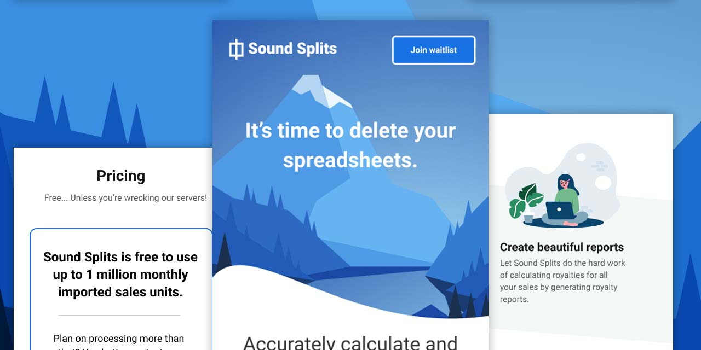
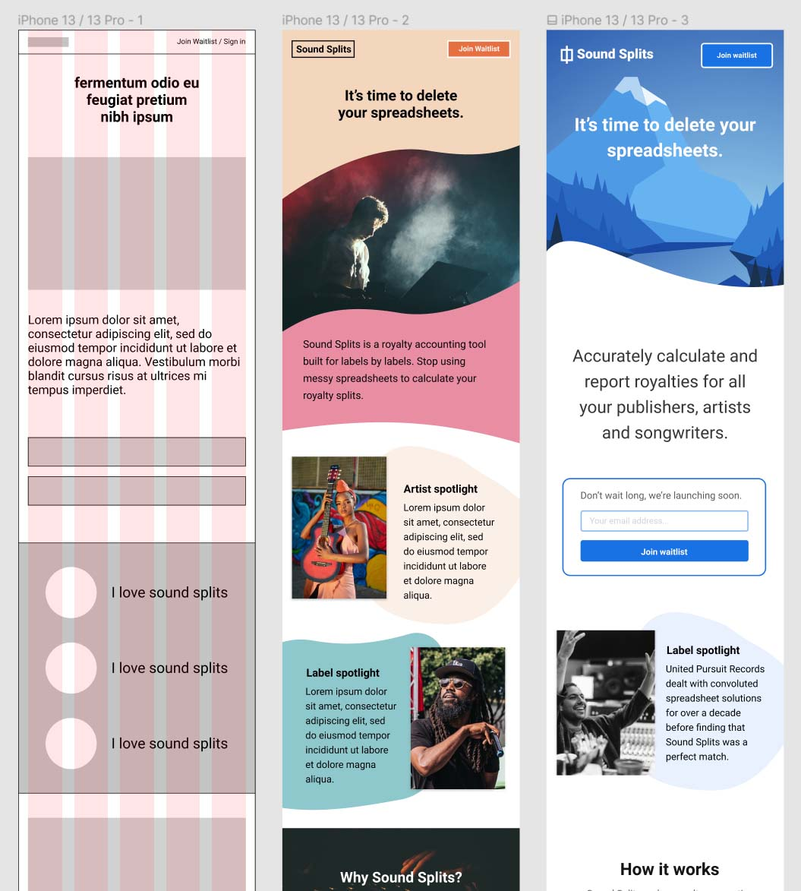

# SoundSplits.com front page

[Live site is available here](https://www.soundsplits.com)

 I partnered with [Zac Rogers](https://github.com/ZacRogersWorks) to put this design together. Zac is a talented UX/UI designer who ran user interviews, created cards, built profiles and brought intentionality to each of the UI/UX decisions. We both riffed on designs and in the end we landed on this one that I put together:

## Implementation Outlook
The implementation of this project was done using Tailwind CSS with a focus on browser compatibility, user accessibility and reusable design patterns that can be utilized throughout the SaaS product.

#### BTS look at the iterative design process: 

